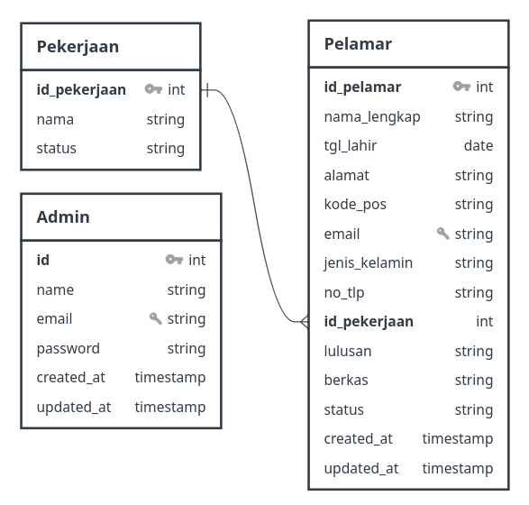
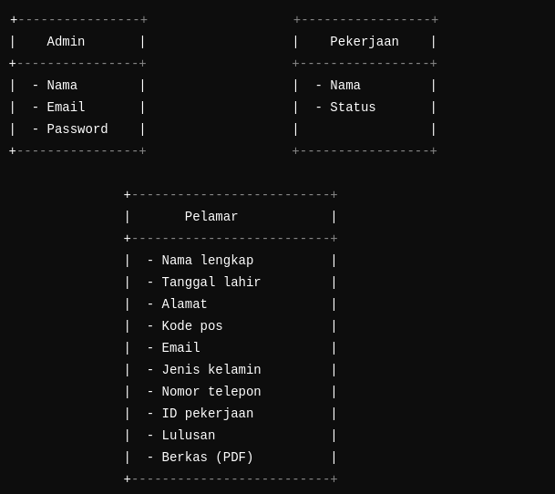
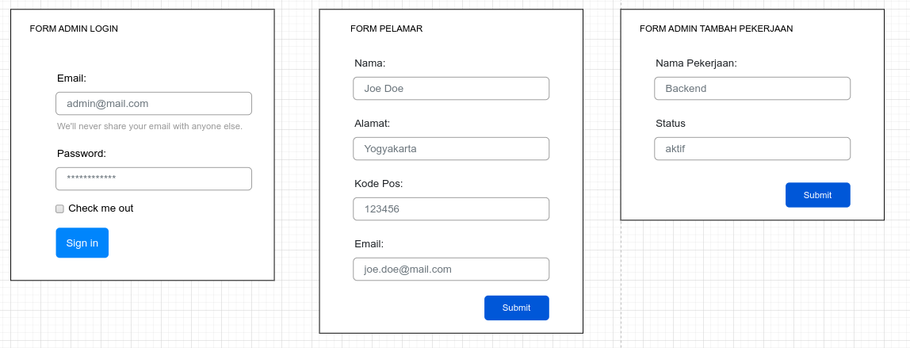
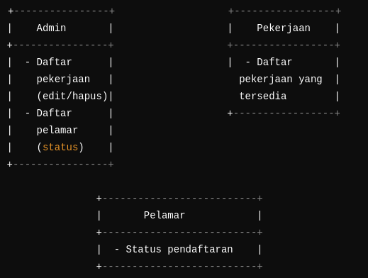

# Desain Database

## Gambar Tabel dan Relasinya



## Pembahasan

### 1. Tabel Admin

**Format Tabel:**

- `id` (int, primary key, auto-increment)
- `name` (varchar)
- `email` (varchar, unique)
- `password` (varchar)
- `created_at` (timestamp)
- `updated_at` (timestamp)

### 2. Tabel Pelamar

**Format Tabel:**

- `id_pelamar` (int, primary key, auto-increment)
- `nama_lengkap` (varchar)
- `tgl_lahir` (date)
- `alamat` (text)
- `kode_pos` (varchar)
- `email` (varchar, unique)
- `jenis_kelamin` (enum: 'L', 'P') -- Laki-laki, Perempuan
- `no_tlp` (varchar)
- `id_pekerjaan` (int, foreign key to `pekerjaan.id_pekerjaan`)
- `lulusan` (varchar)
- `berkas` (varchar) -- bisa simpan nama file pdf
- `status` (enum: 'pending', 'diterima', 'ditolak')
- `created_at` (timestamp)
- `updated_at` (timestamp)

### 3. Tabel Pekerjaan

**Format Tabel:**

- `id_pekerjaan` (int, primary key, auto-increment)
- `nama` (varchar)
- `status` (enum: 'aktif', 'non-aktif') -- untuk status posisi pekerjaan
- `created_at` (timestamp)
- `updated_at` (timestamp)

### Relasi Antar Tabel

- **Pelamar** memiliki relasi dengan **Pekerjaan** melalui `id_pekerjaan`, di mana setiap pelamar dapat melamar untuk satu posisi kerja.

### SQL Syntax

Berikut adalah contoh syntax SQL untuk membuat tabel-tabelnya :

```sql
CREATE TABLE admins (
    id INT AUTO_INCREMENT PRIMARY KEY,
    name VARCHAR(255) NOT NULL,
    email VARCHAR(255) UNIQUE NOT NULL,
    password VARCHAR(255) NOT NULL,
    created_at TIMESTAMP DEFAULT CURRENT_TIMESTAMP,
    updated_at TIMESTAMP DEFAULT CURRENT_TIMESTAMP ON UPDATE CURRENT_TIMESTAMP
);

CREATE TABLE pekerjaan (
    id_pekerjaan INT AUTO_INCREMENT PRIMARY KEY,
    nama VARCHAR(255) NOT NULL,
    status ENUM('aktif', 'non-aktif') DEFAULT 'aktif',
    created_at TIMESTAMP DEFAULT CURRENT_TIMESTAMP,
    updated_at TIMESTAMP DEFAULT CURRENT_TIMESTAMP ON UPDATE CURRENT_TIMESTAMP
);

CREATE TABLE pelamar (
    id_pelamar INT AUTO_INCREMENT PRIMARY KEY,
    nama_lengkap VARCHAR(255) NOT NULL,
    tgl_lahir DATE NOT NULL,
    alamat TEXT,
    kode_pos VARCHAR(10),
    email VARCHAR(255) UNIQUE NOT NULL,
    jenis_kelamin ENUM('L', 'P'),
    no_tlp VARCHAR(20),
    id_pekerjaan INT,
    lulusan VARCHAR(255),
    berkas VARCHAR(255),  -- nama file pdf
    status ENUM('pending', 'diterima', 'ditolak') DEFAULT 'pending',
    created_at TIMESTAMP DEFAULT CURRENT_TIMESTAMP,
    updated_at TIMESTAMP DEFAULT CURRENT_TIMESTAMP ON UPDATE CURRENT_TIMESTAMP,
    FOREIGN KEY (id_pekerjaan) REFERENCES pekerjaan(id_pekerjaan) ON DELETE SET NULL
);
```

# Input dan Output

## Gambar Input



## Form Input



## Gambar Output



## Pembahasan

Berikut pembahasan tentang input dan output dari aplikasi rekrutmen karyawan yang sudah dirancang:

### 1. **Input**

- **Admin**

  - **Nama, Email, Password**: Admin memasukkan data pribadinya untuk login dan mengelola aplikasi. Setelah login, admin dapat menambah, mengedit, atau menghapus data pekerjaan dan memantau status pelamar. Input ini digunakan untuk otentikasi dan otorisasi admin ke dalam sistem.

- **Pekerjaan**

  - **Nama Pekerjaan**: Admin menginput nama posisi yang tersedia, misalnya "Software Engineer" atau "Marketing Manager."
  - **Status Pekerjaan**: Admin menentukan apakah posisi tersebut masih **aktif** (dibuka untuk pendaftaran) atau **non-aktif** (ditutup).

- **Pelamar**
  - **Nama Lengkap, Tanggal Lahir, Alamat, Kode Pos, Email, Jenis Kelamin, Nomor Telepon**: Pelamar mengisi informasi pribadi yang penting untuk profil mereka. Data ini berfungsi untuk identifikasi pelamar oleh admin serta keperluan komunikasi.
  - **ID Pekerjaan**: Pelamar memilih pekerjaan yang ingin dilamar berdasarkan pekerjaan yang tersedia di sistem.
  - **Lulusan**: Informasi pendidikan terakhir pelamar sebagai bagian dari persyaratan pekerjaan.
  - **Berkas (PDF)**: Pelamar mengunggah file seperti CV atau portofolio dalam format PDF untuk di-review oleh admin.

### 2. **Output**

- **Admin**

  - **Daftar Pekerjaan**: Admin bisa melihat daftar pekerjaan yang sudah dimasukkan, termasuk opsi untuk mengedit atau menghapus pekerjaan yang sudah tidak relevan atau sudah terisi. Informasi ini digunakan untuk memudahkan admin dalam manajemen posisi pekerjaan.
  - **Daftar Pelamar dengan Status**: Admin dapat melihat daftar pelamar yang sudah mendaftar, bersama dengan status pendaftarannya (pending, diterima, atau ditolak). Informasi ini digunakan untuk memantau proses aplikasi.

- **Pekerjaan**

  - **Daftar Pekerjaan yang Tersedia**: Sistem menampilkan daftar pekerjaan yang tersedia dan berstatus aktif. Ini memudahkan pelamar untuk memilih posisi yang masih dibuka.

- **Pelamar**
  - **Status Pendaftaran**: Setelah mendaftar, pelamar hanya dapat melihat status aplikasi mereka, apakah masih **pending**, sudah **diterima**, atau **ditolak**. Informasi ini penting agar pelamar bisa mengetahui sejauh mana proses aplikasi mereka.

### Kesimpulan:

Desain input dan output ini dirancang untuk memudahkan proses rekrutmen, di mana **Admin** dapat mengelola pekerjaan dan pelamar, **Pekerjaan** dapat ditampilkan dengan statusnya yang jelas, dan **Pelamar** dapat memasukkan data lengkap serta memantau status aplikasi mereka.
